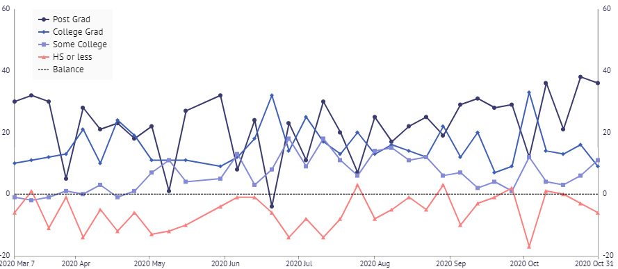
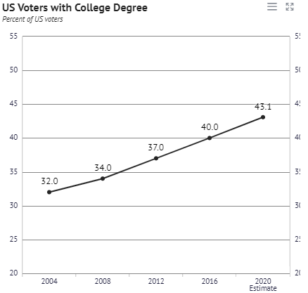

# Voter_Data_Project
Team members: Alex Goldstein, Jeff Johnson, Melvin Byrd, Katie Carns

### Purpose:
 Observation of North Carolina's GOP shift from the 2016 election to the 2020 election. 

### Summary:
 Interested in following the migration of Bachelor's Degree Educated voters in North Carolina over the last two election cycles either towards or away from the GOP. In addition we’re also looking for the movement of polling locations in North Carolina over the same time period tracking ease of voting.

* Changes in voter registration by county (Democrat vs Republican)
* Concentration of college educated adults vs. adults with no degree in each respective county.
* Investigate any change in polling locations (number or physical location) to determine North Carolinians ability to vote.

### Visuals:
* Hosting on GitHub-io
* Map overlay of polling locations using leaflet markers
* Plotly.js graphs

### Resources:
#### Pew Research
*https://www.pewresearch.org/politics/2015/04/07/party-identification-trends-1992-2014/#education
#### North Carolina State Board of Elections
*https://www.ncsbe.gov/results-data/polling-place-data
#### US Census
*https://www.census.gov/topics/public-sector/voting/data/tables.html

### Inspiration

